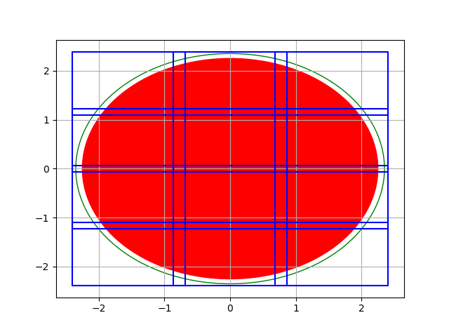
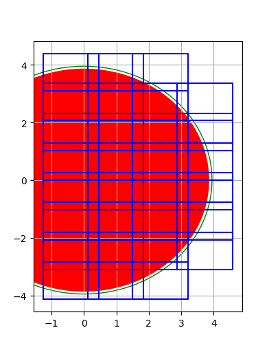

# SpiceTools
This repository contains assorted modules for working with MAPPS and
Spice, e.g. manipulating timestamps, analyzing power consumption,
and generating mosaic instructions.

_Note: None of the tools properly documented actually integrates
 into SPICE yet. The Flyby package is a work in progress._
## Available packages

### timestamps.py
 - Translating between relative and absolute timestamps, e.g.
 `CLS_APP_CAL +06:28:00` to `2031-04-26T05:08:47Z`, and vice versa.
 - Batch processing timestamps in ITL files.

```python
>>> from timestamps import TimestampProcessor
>>> p = TimestampProcessor('2031-04-25T22:40:47')
>>> p.utc2delta('2031-04-25T23:42:50')
'+01:02:03'
>>> p.delta2utc('+01:02:03')
'2031-04-25T23:42:50'
>>> p.absolute_to_relative_timestamps_itl(
...     'tests\\test_itl_file_in.itl',
...     'tests\\test_itl_file_out.itl',
...     "CLS_APP_CAL")
>>> import filecmp
>>> filecmp.cmp('tests\\test_itl_file_out.itl',
...             'tests\\test_itl_file_ref.itl',
...             shallow=False)
True
```

### power_analysis.py
Performing analysis of consumed resources on MAPPS output data:
```python
>>> from matplotlib import pyplot as plt
>>> from power_analysis import PowerConsumptionGraph
>>> pcg = PowerConsumptionGraph("14C6", '2031-04-25T22:40:47',
...                            r"C:\MAPPS\JUICE_SO\MAPPS\OUTPUT_DATA\14C6_COMPLETE_test_resources.csv",
...                            power_limit_Wh=4065.0)
>>> pcg.print_total_power_consumed()
'Total power consumed: 4199.1 (103.3% of limit).'
>>> pcg.print_individual_instrument_consumption()
'Consumption by instrument:
 - HAA  :   360.0 Wh -  8.6%
 - JMAG :   243.6 Wh -  5.8%
 - PEP  :  1495.1 Wh - 35.6%
 - 3GM  :   670.0 Wh - 16.0%
 - RPWI :   280.1 Wh -  6.7%
 - SWI  :   529.4 Wh - 12.6%
 - RIME :    10.5 Wh -  0.2%
 - JANUS:   316.0 Wh -  7.5%
 - MAJIS:   157.5 Wh -  3.8%
 - GALA :    31.5 Wh -  0.8%
 - UVS  :   105.3 Wh -  2.5%'
>>> pcg.plot()
>>> plt.show()
```


### mosaics.py
Creating optimized mosaics and generating PTX requests.
```python
>>> from mosaics import MosaicGenerator
>>> # A simple 3x4 JANUS mosaic.
>>> m = MosaicGenerator(1.72, 1.29, 2.25, overlap=0.1, edge_margin=0.1, pos_y=-1.29*0.9/2.0)
>>> m.plot_mosaic(trimmed=True)
>>> print(m.generate_offsetAngles(2.0, 1.0))
'No of points: 12.
Total time duration: 36.00 min.
<deltaTimes units='min'>    2.0   1.0   2.0   1.0   2.0   1.0   2.0   1.0   2.0   1.0   2.0   1.0   2.0   1.0   2.0   1.0   2.0   1.0   2.0   1.0   2.0   1.0   2.0   1.0 </deltaTimes>
<xAngles units='deg'>      -1.5  -1.5  -1.5  -1.5  -1.5  -1.5  -1.5  -1.5   0.0   0.0   0.0   0.0   0.0   0.0   0.0   0.0   1.5   1.5   1.5   1.5   1.5   1.5   1.5   1.5 </xAngles>
<xRates units='deg/min'>    0.0   0.0   0.0   0.0   0.0   0.0   0.0   0.0   0.0   0.0   0.0   0.0   0.0   0.0   0.0   0.0   0.0   0.0   0.0   0.0   0.0   0.0   0.0   0.0 </xRates>
<yAngles units='deg'>      -1.7  -1.7 -0.58 -0.58  0.58  0.58   1.7   1.7   1.7   1.7  0.58  0.58 -0.58 -0.58  -1.7  -1.7  -1.7  -1.7 -0.58 -0.58  0.58  0.58   1.7   1.7 </yAngles>
<yRates units='deg/min'>    0.0   0.0   0.0   0.0   0.0   0.0   0.0   0.0   0.0   0.0   0.0   0.0   0.0   0.0   0.0   0.0   0.0   0.0   0.0   0.0   0.0   0.0   0.0   0.0 </yRates>'
>>> plt.grid(True)
>>> plt.show()
```



```python
>>> # A large JANUS mosaic with only imaging of illuminated side.
>>> m = MosaicGenerator(1.72, 1.29, 7.7 / 2, overlap=0.2, edge_margin=0.1, pos_x=-0.4, pos_y=0.645)
>>> m.plot_mosaic(trimmed=True, condition="r.center[0]>-1.0")
>>> print(m.generate_offsetAngles(0.5, 0.3, condition="r.center[0]>-1.0"))
'No of points: 30.
Total time duration: 24.00 min.
<deltaTimes units='min'>    0.5   0.3   0.5   0.3   0.5   0.3   0.5   0.3   0.5   0.3   0.5   0.3   0.5   0.3   0.5   0.3   0.5   0.3   0.5   0.3   0.5   0.3   0.5   0.3   0.5   0.3   0.5   0.3   0.5   0.3   0.5   0.3   0.5   0.3   0.5   0.3   0.5   0.3   0.5   0.3   0.5   0.3   0.5   0.3   0.5   0.3   0.5   0.3   0.5   0.3   0.5   0.3   0.5   0.3   0.5   0.3   0.5   0.3   0.5   0.3 </deltaTimes>
<xAngles units='deg'>      -0.4  -0.4  -0.4  -0.4  -0.4  -0.4  -0.4  -0.4  -0.4  -0.4  -0.4  -0.4  -0.4  -0.4  -0.4  -0.4  0.98  0.98  0.98  0.98  0.98  0.98  0.98  0.98  0.98  0.98  0.98  0.98  0.98  0.98  0.98  0.98   2.4   2.4   2.4   2.4   2.4   2.4   2.4   2.4   2.4   2.4   2.4   2.4   2.4   2.4   2.4   2.4   3.7   3.7   3.7   3.7   3.7   3.7   3.7   3.7   3.7   3.7   3.7   3.7 </xAngles>
<xRates units='deg/min'>    0.0   0.0   0.0   0.0   0.0   0.0   0.0   0.0   0.0   0.0   0.0   0.0   0.0   0.0   0.0   0.0   0.0   0.0   0.0   0.0   0.0   0.0   0.0   0.0   0.0   0.0   0.0   0.0   0.0   0.0   0.0   0.0   0.0   0.0   0.0   0.0   0.0   0.0   0.0   0.0   0.0   0.0   0.0   0.0   0.0   0.0   0.0   0.0   0.0   0.0   0.0   0.0   0.0   0.0   0.0   0.0   0.0   0.0   0.0   0.0 </xRates>
<yAngles units='deg'>      -3.5  -3.5  -2.5  -2.5  -1.4  -1.4 -0.39 -0.39  0.65  0.65   1.7   1.7   2.7   2.7   3.7   3.7   3.7   3.7   2.7   2.7   1.7   1.7  0.65  0.65 -0.39 -0.39  -1.4  -1.4  -2.5  -2.5  -3.5  -3.5  -3.5  -3.5  -2.5  -2.5  -1.4  -1.4 -0.39 -0.39  0.65  0.65   1.7   1.7   2.7   2.7   3.7   3.7   2.7   2.7   1.7   1.7  0.65  0.65 -0.39 -0.39  -1.4  -1.4  -2.5  -2.5 </yAngles>
<yRates units='deg/min'>    0.0   0.0   0.0   0.0   0.0   0.0   0.0   0.0   0.0   0.0   0.0   0.0   0.0   0.0   0.0   0.0   0.0   0.0   0.0   0.0   0.0   0.0   0.0   0.0   0.0   0.0   0.0   0.0   0.0   0.0   0.0   0.0   0.0   0.0   0.0   0.0   0.0   0.0   0.0   0.0   0.0   0.0   0.0   0.0   0.0   0.0   0.0   0.0   0.0   0.0   0.0   0.0   0.0   0.0   0.0   0.0   0.0   0.0   0.0   0.0 </yRates>'
>>> plt.grid(True)
>>> plt.show()
```



### flybys.py
Tools for analyzing various properties of flybys such as surface coverage, resolution,
altitude, etc.

```python
>>> import spiceypy as spy
>>> from flybys import Flyby
'CSPICE_N0066
Numpy version: 1.13.3'
>>> # Load the CREMA3.2 metakernels for JUICE
>>> MK_C32 = r"C:\Users\Marcel Stefko\Kernels\JUICE\mk\juice_crema_3_2_v151.tm"
>>> spy.furnsh(MK_C32)
>>> # Analyze Callisto flyby
>>> C = Flyby("CALLISTO", spy.str2et("25 Apr 2031 12:00"), 300000, name="14C6_c3.2", step=1.0, count=5000)
'Analyzing flyby 14C6_c3.2...'
>>> C.print_properties()
'Flyby properties: 14C6_c3.2
 - Body: CALLISTO
 - Closest approach:
    - Time: 2031 APR 25 22:40:46
    - Alt: 199.1 km
    - Lon: 35.3 deg
    - Lat: -25.1 deg
 - Start: 2031 APR 25 05:22:40
 - End:   2031 APR 26 15:55:19
 - Max alt: 300000.0 km'
>>> # Unload metakernel
>>> spy.unload(MK_C32)

>>> from mpl_toolkits.basemap import Basemap
>>> from matplotlib import pyplot as plt
>>> map = Basemap()
>>> map.drawmeridians(np.arange(0,360,30))
>>> map.drawparallels(np.arange(-90,90,30))
>>> a = C.plot_ground_track_to_map(map, c=C.get_nadir_solar_angle(), cmap="plasma", vmin=0, vmax=90.0, s=1)
>>> a.cmap.set_under('g')
>>> plt.title('Solar incidence (green = shade) [-]')
>>> plt.colorbar(shrink=0.55)
>>> plt.show()
```


```python
>>> C.plot_profile(plt.gcf())
>>> plt.show()
```

