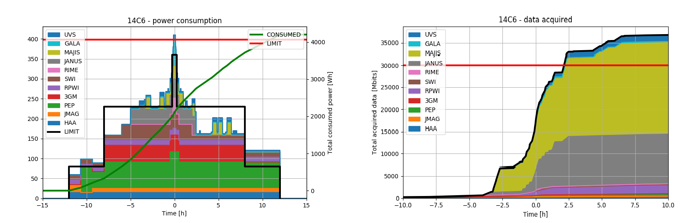
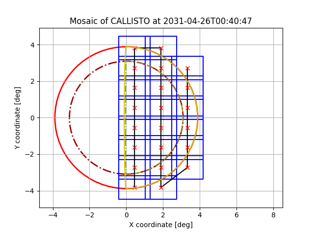
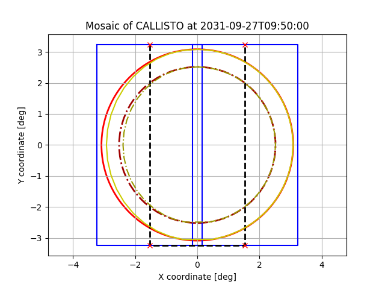

# MappsTools
This repository contains modules for working with MAPPS and
Spice, e.g. manipulating timestamps, analyzing power consumption,
and generating mosaic instructions.

# Feature overview

## Resource analysis of MAPPS datapacks

For details see **[resource_analysis.md](doc/resource_analysis.md)**

## Generation of JANUS mosaics and PTR requests

One can generate either a full-disk mosaic, or mosaic of the sun-illuminated
surface of a body.

| Python plot | Resulting slew |
| :--------: | :--------: |
|  |  |

For details see **[JANUS mosaics.md](doc/JANUS_mosaics.md)**

## Generation of MAJIS slews and PTR requests
Again, the slew can either cover the whole disk, or only the sun-illuminated portion.

| Python plot | Resulting slew |
| :--------: | :--------: |
|  |  |

For details see **[MAJIS scans.md](doc/MAJIS_scans.md)**

## Timestamp processing
Translating between relative and absolute timestamps in MAPPS config files, e.g.
`CLS_APP_CAL +06:28:00` to `2031-04-26T05:08:47Z`, and vice versa.

For details see **[timestamps.md](doc/timestamps.md)**

# Tutorials

Example scripts are available in the [examples](examples/) folder.

Tutorials:
 - **[JANUS mosaics](doc/JANUS_mosaics.md)**
 - **[MAJIS scans](doc/MAJIS_scans.md)**
 - **[timestamps](doc/timestamps.md)**
 - **[resource_analysis](doc/resource_analysis.md)**

# Installation instructions

## Using Anaconda (recommended)
The Anaconda environment manager will automatically download and install required
Python version.

 1. Clone the project to a local folder.
 1. Navigate to project root folder in terminal.
 2. Create new Anaconda environment called `mapps_tools` with `python3.6` and required
 packages:
   - `conda env create -f environment.yml`
 4. Activate the newly created environment:
   - `activate mapps_tools`
   - (Using bash, you need to do `source activate mapps_tools`.)
 3. Run tests to see if everything is working:
   - `python setup.py test`
   - You can now `import mapps_tools`, `import mapps_tools.mosaics`, etc. when you are in the root project folder.
 4. (Optional) If you want to use the module outside of its working directory, you need to install it into the current environment:
   - `python setup.py install`
   - You can now `import mapps_tools`, `import mapps_tools.mosaics`, etc. anywhere.

## Without Anaconda

**You need `Python 3.6.0` or higher. Check this using `python -V` in the terminal, and update if necessary.**

### Windows
When not using Anaconda, Windows users need to install the [Shapely](https://pypi.python.org/pypi/Shapely/1.5.17) library manually first:
 1. Download appropriate pip wheel for you from [this site](https://www.lfd.uci.edu/~gohlke/pythonlibs/#shapely). E.g.:
   - 64-bit, python3.6: `Shapely‑1.6.4.post1‑cp36‑cp36m‑win_amd64.whl`
   - 32-bit, python3.7: `Shapely‑1.6.4.post1‑cp37‑cp37m‑win32.whl`
   - etc.
 2. Install it using `pip install <whl_file_name>`.

Afterwards, follow the instructions for Mac/Linux.

### Mac/Linux
 1. Clone the project to a local folder.
 1. Navigate to project root folder in terminal.
 3. Run tests to see if everything is working:
   - `python setup.py test`
   - You can now `import mapps_tools`, `import mapps_tools.mosaics`, etc. when you are in the root project folder.
 4. (Optional) If you want to use the module outside of its working directory, you need to install it into the local Python module index:
   - `python setup.py install`
   - You can now `import mapps_tools`, `import mapps_tools.mosaics`, etc. anywhere.

# Troubleshooting
In case of any issues, contact [Marcel Stefko](mailto:marcel.stefko@esa.int). If you have an ESA GitLab account, you can also open an issue in the project.

# Acknowledgments
Many thanks to Andrew Annex for developing and sharing the great [SpiceyPy](https://github.com/AndrewAnnex/SpiceyPy) package.
