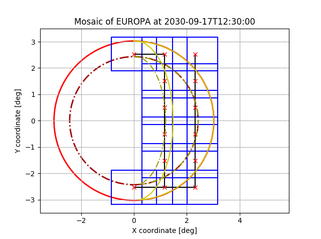

# SpiceTools
This repository contains assorted modules for working with MAPPS and
Spice, e.g. manipulating timestamps, analyzing power consumption,
and generating mosaic instructions.

## Feature overview

### Resource analysis of MAPPS datapacks


### Generation of JANUS mosaics and PTR requests

One can generate either a full-disk mosaic, or mosaic of the sun-illuminated
surface of a body.


### Generation of MAJIS slews and PTR requests
Again, the slew can either cover the whole disk, or only the sun-illuminated portion.

## timestamps.py
 - Translate between relative and absolute timestamps in MAPPS config files, e.g.
 `CLS_APP_CAL +06:28:00` to `2031-04-26T05:08:47Z`, and vice versa.
 - Batch process timestamps in ITL files.

```python
>>> from timestamps import TimestampProcessor
>>> p = TimestampProcessor('2031-04-25T22:40:47')
>>> p.utc2delta('2031-04-25T23:42:50')
'+01:02:03'
>>> p.delta2utc('+01:02:03')
'2031-04-25T23:42:50'
>>> p.absolute_to_relative_timestamps_itl(
...     'tests\\test_itl_file_in.itl',
...     'tests\\test_itl_file_out.itl',
...     "CLS_APP_CAL")
>>> import filecmp
>>> filecmp.cmp('tests\\test_itl_file_out.itl',
...             'tests\\test_itl_file_ref.itl',
...             shallow=False)
True
```

## power_analysis.py
Perform analysis of consumed resources on a MAPPS scenario.
```python
>>> from matplotlib import pyplot as plt
>>> from power_analysis import PowerConsumptionGraph
# Import MAPPS datapack containing spacecraft resource data
>>> pcg = PowerConsumptionGraph("14C6", '2031-04-25T22:40:47',
...                            r"tests\14c6_test_attitude_and_data.csv",
...                            power_limit_Wh=4065.0)
>>> pcg.print_total_power_consumed()
'Total power consumed: 4199.1 (103.3% of limit).'
>>> pcg.print_individual_instrument_consumption()
'Consumption by instrument:
 - HAA  :   360.0 Wh -  8.6%
 - JMAG :   243.6 Wh -  5.8%
 - PEP  :  1495.1 Wh - 35.6%
 - 3GM  :   670.0 Wh - 16.0%
 - RPWI :   280.1 Wh -  6.7%
 - SWI  :   529.4 Wh - 12.6%
 - RIME :    10.5 Wh -  0.2%
 - JANUS:   316.0 Wh -  7.5%
 - MAJIS:   157.5 Wh -  3.8%
 - GALA :    31.5 Wh -  0.8%
 - UVS  :   105.3 Wh -  2.5%'
>>> pcg.plot()
>>> plt.show()
```


```python
>>> from power_analysis import DataConsumptionGraph
# We can use the same datapack, as long as it contains required fields
# with data consumption values.
>>> dcg = DataConsumptionGraph("14C6", '2031-04-25T22:40:47',
...                            r"tests\14c6_test_attitude_and_data.csv",
...                            data_limit_Mbits=30000.0)
>>> dcg.print_total_data_acquired()
'Total data acquired: 36896.2 Mbits (123.0% of limit).'
>>> dcg.print_individual_instrument_data()
'Consumption by instrument:
 - HAA  :   172.8 Mbits -  0.5%
 - JMAG :   303.4 Mbits -  0.8%
 - PEP  :   561.3 Mbits -  1.5%
 - 3GM  :     5.8 Mbits -  0.0%
 - RPWI :  2054.5 Mbits -  5.6%
 - SWI  :    19.4 Mbits -  0.1%
 - RIME :   249.3 Mbits -  0.7%
 - JANUS:  11184.8 Mbits - 30.3%
 - MAJIS:  20734.1 Mbits - 56.2%
 - GALA :    66.0 Mbits -  0.2%
 - UVS  :  1544.9 Mbits -  4.2%'
>>> dcg.plot()
>>> plt.show()
```


## mosaics
This module allows you to automatically create JANUS mosaics of either the full
disk of a certain body, or of the sun-illuminated part.
```python
>>> from datetime import datetime
>>> import spiceypy as spy
>>> MK_C32 = r"C:\Users\Marcel Stefko\Kernels\JUICE\mk\juice_crema_3_2_v151.tm"
>>> spy.furnsh(MK_C32)

>>> from mosaics import JanusMosaicGenerator

# JANUS disk mosaic of Callisto during 14C6 ingress
>>> jmg = JanusMosaicGenerator("CALLISTO", "min", "deg")
>>> start_time = datetime.strptime("2031-04-25T18:40:47", "%Y-%m-%dT%H:%M:%S")
>>> dm = jmg.generate_optimized_mosaic_iterative(start_time,
                                                 max_exposure_time_s=15,
                                                 max_smear=0.25,
                                                 stabilization_time_s=5,
                                                 no_of_filters=4,
                                                 extra_margin=0.05)
''''Iteration no. 1 out of 30
         Growth factor estimate:    1.004
         Margin estimate:           0.054
         Duration estimate:         1.00000 min

...

Iteration no. 4 out of 30
         Growth factor estimate:    1.123
         Margin estimate:           0.173
         Duration estimate:         26.51667 min

*** STOP ITERATION - EQUILLIBRIUM REACHED ***

JANUS MOSAIC ITERATIVE GENERATOR REPORT:
 Target: CALLISTO
 No of filters: 4
 Max smear: 0.25 px
 Overlap: 0.100
 Stabilization time: 5.000 s
 JUICE slew rate: 1.500 deg / min
 Start time: 2031-04-25T18:40:47
 End time:   2031-04-25T19:07:18
 Duration: 0:26:31
 Total number of images: 48 (12 positions, 4 filters at each position).
 Uncompressed data volume: 2021.376 Mbits
 Uncompressed average data rate: 1270.507 kbits/s
 Calculated max exposure time: 15.000 s
 Used exposure time:           15.000 s
 Used dwell time: 80.000 s (1.333 min in generator)

 No of iterations: 30
 Requested margin: 5.000 $
 Real margin:      5.000 %
 Growth factor:    1.123
'''
>>> print(dm.generate_PTR(decimal_places=3))
```

```xml
<block ref="OBS">
	<startTime> 2031-04-25T18:40:47 </startTime>
	<endTime> 2031-04-25T19:07:18 </endTime>
	<attitude ref="track">
		<boresight ref="SC_Zaxis"/>
		<target ref="CALLISTO"/>
		<offsetRefAxis frame="SC">
			<x>1.0</x>
			<y>0.0</y>
			<z>0.0</z>
		</offsetRefAxis>
		<offsetAngles ref="raster">
			<startTime>2031-04-25T18:41:47</startTime>
			<xPoints>3</xPoints>
			<yPoints>4</yPoints>
			<xStart units="deg">-1.438</xStart>
			<yStart units="deg">-1.653</yStart>
			<xDelta units="deg">1.438</xDelta>
			<yDelta units="deg">1.102</yDelta>
			<pointSlewTime units="min">0.735</pointSlewTime>
			<lineSlewTime units="min">0.958</lineSlewTime>
			<dwellTime units="min">1.333</dwellTime>
			<lineAxis>Y</lineAxis>
			<keepLineDir>false</keepLineDir>
		</offsetAngles>
		<phaseAngle ref="powerOptimised">
			<yDir> false </yDir>
		</phaseAngle>
	</attitude>
</block>
```

```python
>>> dm.plot()
```


```python
# JANUS mosaic of sun-illuminated surface of Europa during 6E1 egress
>>> start_time = datetime.strptime("2030-09-17T12:30:00", "%Y-%m-%dT%H:%M:%S")
>>> jmg = JanusMosaicGenerator("EUROPA", "min", "deg")
>>> cm = jmg.generate_sunside_mosaic(start_time,
                                     duration_guess_minutes=30,
                                     max_exposure_time_s=20,
                                     max_smear=0.25,
                                     stabilization_time_s=5,
                                     no_of_filters=4,
                                     extra_margin=0.05,
                                     overlap=0.15)
>>> print(cm.generate_PTR(decimal_places=3)
```
```xml
<block ref="OBS">
	<startTime> 2030-09-17T12:30:00 </startTime>
	<endTime> 2030-09-17T12:48:44 </endTime>
	<attitude ref="track">
		<boresight ref="SC_Zaxis"/>
		<target ref="EUROPA"/>
		<offsetRefAxis frame="SC">
			<x>1.0</x>
			<y>0.0</y>
			<z>0.0</z>
		</offsetRefAxis>
		<offsetAngles ref="custom">
			<startTime>2030-09-17T12:31:00</startTime>
			<deltaTimes units='min'>   0.246  0.246  0.772  0.246  0.246  0.675  0.246  0.246  0.675  0.246  0.246  0.675  0.246  0.246  0.675  0.246  0.246  0.675  0.246  0.246  0.772  0.246  0.246   1.54  0.246  0.246  0.675  0.246  0.246  0.675  0.246  0.246  0.675  0.246  0.246  0.675  0.246  0.246  0.675  0.246  0.246  0.246 </deltaTimes>
			<xAngles units='deg'>       -0.0   -0.0   -0.0  -1.16  -1.16  -1.16  -1.16  -1.16  -1.16  -1.16  -1.16  -1.16  -1.16  -1.16  -1.16  -1.16  -1.16  -1.16  -1.16  -1.16  -1.16   -0.0   -0.0   -0.0  -2.32  -2.32  -2.32  -2.32  -2.32  -2.32  -2.32  -2.32  -2.32  -2.32  -2.32  -2.32  -2.32  -2.32  -2.32  -2.32  -2.32  -2.32 </xAngles>
			<xRates units='deg/min'>     0.0    0.0    0.0    0.0    0.0    0.0    0.0    0.0    0.0    0.0    0.0    0.0    0.0    0.0    0.0    0.0    0.0    0.0    0.0    0.0    0.0    0.0    0.0    0.0    0.0    0.0    0.0    0.0    0.0    0.0    0.0    0.0    0.0    0.0    0.0    0.0    0.0    0.0    0.0    0.0    0.0    0.0 </xRates>
			<yAngles units='deg'>       2.53   2.53   2.53   2.53   2.53   2.53   1.52   1.52   1.52  0.506  0.506  0.506 -0.506 -0.506 -0.506  -1.52  -1.52  -1.52  -2.53  -2.53  -2.53  -2.53  -2.53  -2.53  -2.53  -2.53  -2.53  -1.52  -1.52  -1.52 -0.506 -0.506 -0.506  0.506  0.506  0.506   1.52   1.52   1.52   2.53   2.53   2.53 </yAngles>
			<yRates units='deg/min'>     0.0    0.0    0.0    0.0    0.0    0.0    0.0    0.0    0.0    0.0    0.0    0.0    0.0    0.0    0.0    0.0    0.0    0.0    0.0    0.0    0.0    0.0    0.0    0.0    0.0    0.0    0.0    0.0    0.0    0.0    0.0    0.0    0.0    0.0    0.0    0.0    0.0    0.0    0.0    0.0    0.0    0.0 </yRates>
		</offsetAngles>
		<phaseAngle ref="powerOptimised">
			<yDir> false </yDir>
		</phaseAngle>
	</attitude>
</block>
```
```python
>>> cm.plot()
```



```python
>>> spy.unload(MK_C32)
>>> MK_C30 = r"C:\Users\Marcel Stefko\Kernels\JUICE\mk\juice_crema_3_0_v151.tm"
>>> spy.furnsh(MK_C30)

# Jupiter mosaic during perijove
>>> start_time = datetime.strptime("2030-05-31T22:40:47", "%Y-%m-%dT%H:%M:%S")
>>> jmg = JanusMosaicGenerator("JUPITER", "min", "deg")
>>> dm = jmg.generate_optimized_mosaic_iterative(start_time,
                                                 max_exposure_time_s=60,
                                                 max_smear=0.25,
                                                 stabilization_time_s=5,
                                                 no_of_filters=12,
                                                 extra_margin=0.05)
>>> dm.plot()
```


## flybys.py
Tools for analyzing various properties of flybys such as surface coverage, resolution,
altitude, etc.

```python
>>> import spiceypy as spy
>>> from flybys import Flyby
'CSPICE_N0066
Numpy version: 1.13.3'
>>> # Load the CREMA3.2 metakernels for JUICE
>>> MK_C32 = r"C:\Users\Marcel Stefko\Kernels\JUICE\mk\juice_crema_3_2_v151.tm"
>>> spy.furnsh(MK_C32)
>>> # Analyze Callisto flyby
>>> C = Flyby("CALLISTO", spy.str2et("25 Apr 2031 12:00"), 300000, name="14C6_c3.2", step=1.0, count=5000)
'Analyzing flyby 14C6_c3.2...'
>>> C.print_properties()
'Flyby properties: 14C6_c3.2
 - Body: CALLISTO
 - Closest approach:
    - Time: 2031 APR 25 22:40:46
    - Alt: 199.1 km
    - Lon: 35.3 deg
    - Lat: -25.1 deg
 - Start: 2031 APR 25 05:22:40
 - End:   2031 APR 26 15:55:19
 - Max alt: 300000.0 km'
>>> # Unload metakernel
>>> spy.unload(MK_C32)

>>> from mpl_toolkits.basemap import Basemap
>>> from matplotlib import pyplot as plt
>>> map = Basemap()
>>> map.drawmeridians(np.arange(0,360,30))
>>> map.drawparallels(np.arange(-90,90,30))
>>> a = C.plot_ground_track_to_map(map, c=C.get_nadir_solar_angle(), cmap="plasma", vmin=0, vmax=90.0, s=1)
>>> a.cmap.set_under('g')
>>> plt.title('Solar incidence (green = shade) [-]')
>>> plt.colorbar(shrink=0.55)
>>> plt.show()
```


```python
>>> C.plot_profile(plt.gcf())
>>> plt.show()
```

