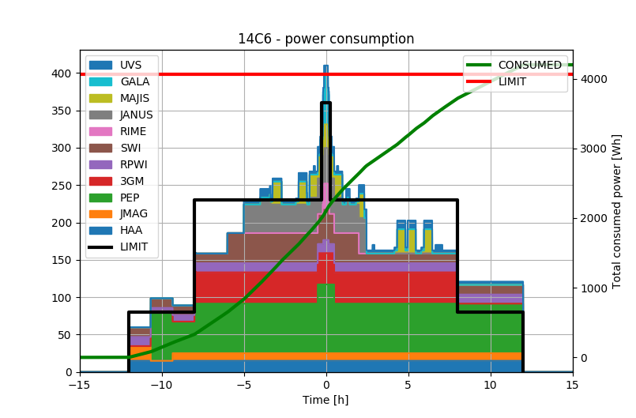

# SpiceTools
This repository contains assorted modules for working with MAPPS and
Spice, e.g. manipulating timestamps, analyzing power consumption,
and generating mosaic instructions.

## Available packages

##### timestamps.py
 - Translating between relative and absolute timestamps, e.g.
 `CLS_APP_CAL +06:28:00` to `2031-04-26T05:08:47Z`, and vice versa.
 - Batch processing timestamps in ITL files.

```python
>>> from timestamps import TimestampProcessor
>>> p = TimestampProcessor('2031-04-25T22:40:47')
>>> p.utc2delta('2031-04-25T23:42:50')
+01:02:03
>>> p.delta2utc('+01:02:03')
2031-04-25T23:42:50
>>> p.absolute_to_relative_timestamps_itl(
...     'tests\\test_itl_file_in.itl',
...     'tests\\test_itl_file_out.itl',
...     "CLS_APP_CAL")
>>> import filecmp
>>> filecmp.cmp('tests\\test_itl_file_out.itl',
...             'tests\\test_itl_file_ref.itl',
...             shallow=False)
True
```

##### power_analysis.py
Performing analysis of consumed resources on MAPPS output data:
```python
>>> from matplotlib import pyplot as plt
>>> from power_analysis import PowerConsumptionGraph
>>> pcg = PowerConsumptionGraph("14C6", '2031-04-25T22:40:47',
...                            r"C:\MAPPS\JUICE_SO\MAPPS\OUTPUT_DATA\14C6_COMPLETE_test_resources.csv",
...                            power_limit_Wh=4065.0)
>>> pcg.print_total_power_consumed()
Total power consumed: 4199.1 (103.3% of limit).
>>> pcg.print_individual_instrument_consumption()
Consumption by instrument:
 - HAA  :   360.0 Wh -  8.6%
 - JMAG :   243.6 Wh -  5.8%
 - PEP  :  1495.1 Wh - 35.6%
 - 3GM  :   670.0 Wh - 16.0%
 - RPWI :   280.1 Wh -  6.7%
 - SWI  :   529.4 Wh - 12.6%
 - RIME :    10.5 Wh -  0.2%
 - JANUS:   316.0 Wh -  7.5%
 - MAJIS:   157.5 Wh -  3.8%
 - GALA :    31.5 Wh -  0.8%
 - UVS  :   105.3 Wh -  2.5%
>>> fig = pcg.plot()
>>> plt.show()
```

