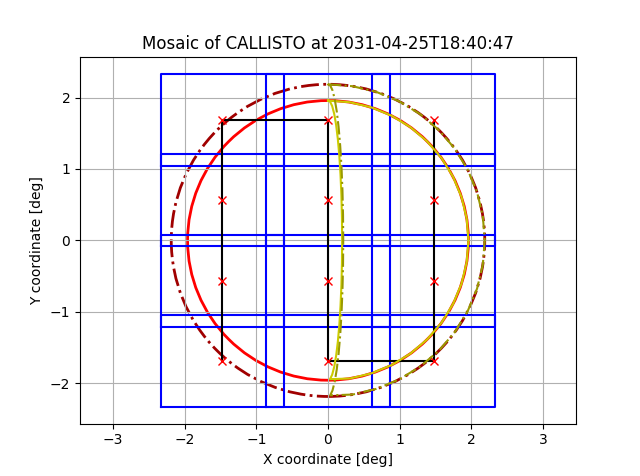
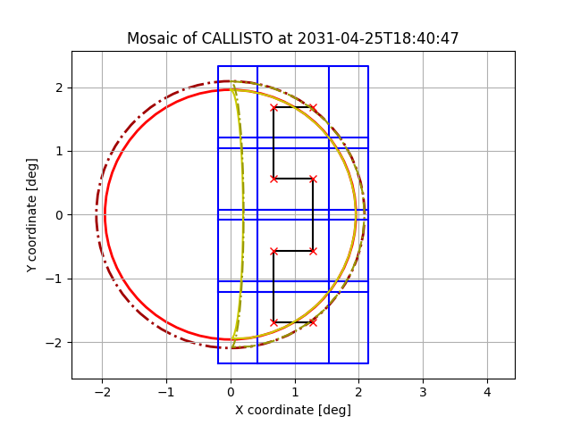

# Creating JANUS mosaics

This tutorial shows you how to generate a JANUS mosaic together with
a MAPPS PTR request.

## Full-disk mosaic
First we need to import the SPICE kernels and datetime library.
```python
from datetime import datetime

# Load the CREMA3.2 metakernel
import spiceypy as spy
MK_C32 = r"C:\Users\Marcel Stefko\Kernels\JUICE\mk\juice_crema_3_2_v151.tm"
spy.furnsh(MK_C32)
```

Now we initialize the `JanusMosaicGenerator`, define the start time of
mosaic, and generate mosaic according to requirements.

```python
from spice_tools.mosaics import JanusMosaicGenerator

# Start time of mosaic during 14C6 ingress
# This function parses the iso8601 timestamp into a datetime object
start_time = datetime.strptime("2031-04-25T18:40:47", "%Y-%m-%dT%H:%M:%S")

# We want a mosaic of Callisto, with units of minutes and degrees
generator = JanusMosaicGenerator("CALLISTO", "min", "deg")

# Generate a DiskMosaic
disk_mosaic = generator.generate_mosaic(
    start_time, # mandatory first argument, the start time
    max_exposure_time_s=15, # maximal time of one exposure, the generator can decide to make it lower
    duration_guess_minutes=30, # estimate of how long the mosaic will be, to compensate for growth over time
    max_smear=0.25, # set max smearing during one exposure to 1/4 of pixel
    stabilization_time_s=5, # stabilization time after each position change
    no_of_filters=4, # number of filters used at each position
    extra_margin=0.05, # margin of 5% around the edge of body (e.g. to capture the atmosphere)
    overlap=0.1, # minimal overlap of 10% between neighboring frames
    sunside=False # we want a full-disk mosaic
    )
```
```
JANUS MOSAIC GENERATOR REPORT:
 Mosaic type: Full disk
 Target: CALLISTO
 No of filters: 4
 Max smear: 0.25 px
 Stabilization time: 5.000 s
 JUICE slew rate: 1.500 deg / min
 Start time: 2031-04-25T18:40:47
 End time:   2031-04-25T19:06:00
 Duration: 0:25:13
 Total number of images: 48 (12 positions, 4 filters at each position).
 Uncompressed data volume: 2021.376 Mbits
 Uncompressed average data rate: 1336.005 kbits/s
 Calculated max exposure time: 48.876 s
 Used exposure time: 15.000 s
 Used dwell time: 72.500 s (1.208 min in generator)
```

Now we can print the MAPPS PTR request.
```python
# Print PTR request with precision of 2 decimal places for generated values.
print(disk_mosaic.generate_PTR(decimal_places=2))
```
```xml
<block ref="OBS">
	<startTime> 2031-04-25T18:40:47 </startTime>
	<endTime> 2031-04-25T19:06:00 </endTime>
	<attitude ref="track">
		<boresight ref="SC_Zaxis"/>
		<target ref="CALLISTO"/>
		<offsetRefAxis frame="SC">
			<x>1.0</x>
			<y>0.0</y>
			<z>0.0</z>
		</offsetRefAxis>
		<offsetAngles ref="raster">
			<startTime>2031-04-25T18:41:47</startTime>
			<xPoints>3</xPoints>
			<yPoints>4</yPoints>
			<xStart units="deg">-1.47</xStart>
			<yStart units="deg">-1.69</yStart>
			<xDelta units="deg">1.47</xDelta>
			<yDelta units="deg">1.13</yDelta>
			<pointSlewTime units="min">0.75</pointSlewTime>
			<lineSlewTime units="min">0.98</lineSlewTime>
			<dwellTime units="min">1.21</dwellTime>
			<lineAxis>Y</lineAxis>
			<keepLineDir>false</keepLineDir>
		</offsetAngles>
		<phaseAngle ref="powerOptimised">
			<yDir> false </yDir>
		</phaseAngle>
	</attitude>
</block>
```
And we preview the mosaic.
```python
disk_mosaic.plot()
```



## Sun-illuminated side mosaic.
We can generate a sun-illuminated mosaic just by changing the parameter
`sunside` in `generator.generate_mosaic()` to `True`

```python
sunside_mosaic = generator.generate_mosaic(
    start_time,
    max_exposure_time_s=15,
    duration_guess_minutes=30,
    max_smear=0.25,
    stabilization_time_s=5,
    no_of_filters=4,
    extra_margin=0.05,
    overlap=0.1,
    sunside=True # we want to image the sun-illuminated side of Callisto
    )

print(sunside_mosaic.generate_PTR(decimal_places=2))
sunside_mosaic.plot()
```
```
JANUS MOSAIC GENERATOR REPORT:
 Mosaic type: Sunside
 Target: CALLISTO
 No of filters: 4
 Max smear: 0.25 px
 Stabilization time: 5.000 s
 JUICE slew rate: 1.500 deg / min
 Start time: 2031-04-25T18:40:47
 End time:   2031-04-25T18:56:20
 Duration: 0:15:33
 Total number of images: 32 (8 positions, 4 filters at each position).
 Uncompressed data volume: 1347.584 Mbits
 Uncompressed average data rate: 1444.356 kbits/s
 Calculated max exposure time: 48.876 s
 Used exposure time: 15.000 s
 Used dwell time: 72.500 s (1.208 min in generator)
```

Note that the PTR request now uses `<offsetAngles ref="custom">` because the mosaic doesn't have to be a raster now.

```xml
<block ref="OBS">
	<startTime> 2031-04-25T18:40:47 </startTime>
	<endTime> 2031-04-25T18:56:20 </endTime>
	<attitude ref="track">
		<boresight ref="SC_Zaxis"/>
		<target ref="CALLISTO"/>
		<offsetRefAxis frame="SC">
			<x>1.0</x>
			<y>0.0</y>
			<z>0.0</z>
		</offsetRefAxis>
		<offsetAngles ref="custom">
			<startTime>2031-04-25T18:41:47</startTime>
			<deltaTimes units='min'>    0.6   0.6  0.41   0.6   0.6  0.75   0.6   0.6  0.41   0.6   0.6  0.75   0.6   0.6  0.41   0.6   0.6  0.75   0.6   0.6  0.41   0.6   0.6   0.6 </deltaTimes>
			<xAngles units='deg'>      -1.3  -1.3  -1.3 -0.67 -0.67 -0.67 -0.67 -0.67 -0.67  -1.3  -1.3  -1.3  -1.3  -1.3  -1.3 -0.67 -0.67 -0.67 -0.67 -0.67 -0.67  -1.3  -1.3  -1.3 </xAngles>
			<xRates units='deg/min'>    0.0   0.0   0.0   0.0   0.0   0.0   0.0   0.0   0.0   0.0   0.0   0.0   0.0   0.0   0.0   0.0   0.0   0.0   0.0   0.0   0.0   0.0   0.0   0.0 </xRates>
			<yAngles units='deg'>       1.7   1.7   1.7   1.7   1.7   1.7  0.56  0.56  0.56  0.56  0.56  0.56 -0.56 -0.56 -0.56 -0.56 -0.56 -0.56  -1.7  -1.7  -1.7  -1.7  -1.7  -1.7 </yAngles>
			<yRates units='deg/min'>    0.0   0.0   0.0   0.0   0.0   0.0   0.0   0.0   0.0   0.0   0.0   0.0   0.0   0.0   0.0   0.0   0.0   0.0   0.0   0.0   0.0   0.0   0.0   0.0 </yRates>
		</offsetAngles>
		<phaseAngle ref="powerOptimised">
			<yDir> false </yDir>
		</phaseAngle>
	</attitude>
</block>
```
