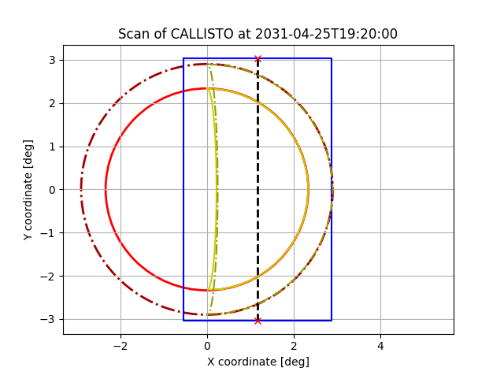

# Creating JANUS mosaics

This tutorial shows you how to generate a MAJIS scan together with
a MAPPS PTR request.

## Full-disk mosaic
First we need to import the SPICE kernels and datetime library.
```python
from datetime import datetime

# Load the CREMA3.2 metakernel
import spiceypy as spy
MK_C32 = r"C:\Users\Marcel Stefko\Kernels\JUICE\mk\juice_crema_3_2_v151.tm"
spy.furnsh(MK_C32)
```

Now we initialize the `MajisScanGenerator`, define the start time of
scan and generate full-disk scan according to requirements.

```python
from spice_tools.mosaics import MajisScanGenerator

# Start time of scan during 22C11 egress
# This function parses the iso8601 timestamp into a datetime object
start_time = datetime.strptime("2031-09-27T09:50:00", "%Y-%m-%dT%H:%M:%S")

# We want a scan of Callisto, with units of minutes and degrees
generator = MajisScanGenerator("CALLISTO", "min", "deg")

# Generate a disk scan
disk_scan = generator.generate_scan(
    start_time,
    exposure_time_s=2,  # 2 seconds exposure per one horizontal line
    margin=0.05, # margin of 5% around the edge of body (e.g. to capture the atmosphere)
    overlap=0.05 # minimal overlap of 5% between neighboring vertical slews
    )
```
```
MAJIS SCAN GENERATOR REPORT:
             Scan type: Full disk
             Target: CALLISTO
             JUICE slew rate: 1.500 deg / min
             Start time: 2031-09-27T09:50:00
             End time:   2031-09-27T11:03:31
             Duration: 1:13:31
             Total number of vertical scans: 2
             Uncompressed data volume: 12966.985 Mbits
             Uncompressed average data rate: 2939.693 kbits/s
             Line exposure time: 2.000 s
             Scan slew rate: 0.21485917317405873 deg/min
```

Now we can print the MAPPS PTR request.
```python
# Print PTR request with precision of 2 decimal places for generated values.
print(disk_scan.generate_PTR(decimal_places=2))
```
```xml
<block ref="OBS">
	<startTime> 2031-09-27T09:50:00 </startTime>
	<endTime> 2031-09-27T11:03:31 </endTime>
	<attitude ref="track">
		<boresight ref="SC_Zaxis"/>
		<target ref="CALLISTO"/>
		<offsetRefAxis frame="SC">
			<x>1.0</x>
			<y>0.0</y>
			<z>0.0</z>
		</offsetRefAxis>
		<offsetAngles ref="scan">
			<startTime>2031-09-27T09:55:10</startTime>
			<numberOfLines> 2 </numberOfLines>
			<xStart units="deg">1.54</xStart>
			<yStart units="deg">3.24</yStart>
			<lineDelta units="deg">-3.08</lineDelta>
			<scanDelta units="deg">-6.48</scanDelta>
			<scanSpeed units="deg/min">0.21</scanSpeed>
			<scanSlewTime units="min">1.0</scanSlewTime>
			<lineSlewTime units="min">2.05</lineSlewTime>
			<borderSlewTime units="min">5.00</borderSlewTime>
			<lineAxis>Y</lineAxis>
			<keepLineDir>false</keepLineDir>
		</offsetAngles>
		<phaseAngle ref="powerOptimised">
			<yDir> false </yDir>
		</phaseAngle>
	</attitude>
</block>
```
And we preview the scan.
```python
disk_scan.plot()
```


## Sun-illuminated scan.
We can generate a sun-illuminated scan just by changing the parameter
`sunside` in `generator.generate_scan()` to `True`. We showcase it on
14C6 ingress, because during 22C11 the face of Callisto is almost
completely illuminated so the result would be the same as if using
`sunside=False`.

Note that we need to increase `margin` because Callisto grows during
the course of the scan, and coordinates are calculated at start time.
Value `margin=0.30` was determined by trial and error.

```python
# Generate a sunside scan during 14C6 ingress
start_time_14C6 = datetime.strptime("2031-04-25T19:20:00", "%Y-%m-%dT%H:%M:%S")
sunside_scan = disk_scan = generator.generate_scan(
    start_time_14C6,
    exposure_time_s=2,
    margin=0.30, # we need a larger margin because Callisto grows over the course of scan
    overlap=0.05,
    sunside=True # we want a sunside scan
    )

print(sunside_scan.generate_PTR(decimal_places=2))

sunside_scan.plot()
```
```
MAJIS SCAN GENERATOR REPORT:
             Scan type: Sunside
             Target: CALLISTO
             JUICE slew rate: 1.500 deg / min
             Start time: 2031-04-25T19:20:00
             End time:   2031-04-25T19:59:27
             Duration: 0:39:27
             Total number of vertical scans: 1
             Uncompressed data volume: 6082.290 Mbits
             Uncompressed average data rate: 2569.620 kbits/s
             Line exposure time: 2.000 s
             Scan slew rate: 0.21485917317405873 deg/min
```

```xml
<block ref="OBS">
	<startTime> 2031-04-25T19:20:00 </startTime>
	<endTime> 2031-04-25T19:59:27 </endTime>
	<attitude ref="track">
		<boresight ref="SC_Zaxis"/>
		<target ref="CALLISTO"/>
		<offsetRefAxis frame="SC">
			<x>1.0</x>
			<y>0.0</y>
			<z>0.0</z>
		</offsetRefAxis>
		<offsetAngles ref="scan">
			<startTime>2031-04-25T19:25:10</startTime>
			<numberOfLines> 1 </numberOfLines>
			<xStart units="deg">-1.17</xStart>
			<yStart units="deg">3.04</yStart>
			<lineDelta units="deg">-1.00</lineDelta>
			<scanDelta units="deg">-6.08</scanDelta>
			<scanSpeed units="deg/min">0.21</scanSpeed>
			<scanSlewTime units="min">1.0</scanSlewTime>
			<lineSlewTime units="min">0.67</lineSlewTime>
			<borderSlewTime units="min">5.00</borderSlewTime>
			<lineAxis>Y</lineAxis>
			<keepLineDir>false</keepLineDir>
		</offsetAngles>
		<phaseAngle ref="powerOptimised">
			<yDir> false </yDir>
		</phaseAngle>
	</attitude>
</block>
```
