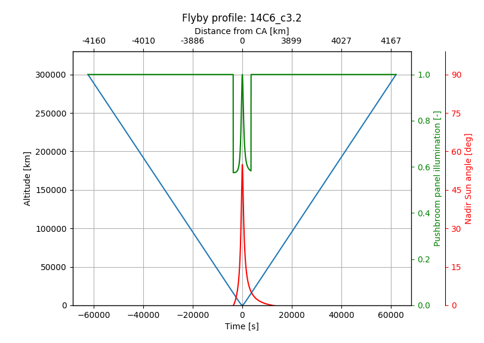

# Flybys

Tools for analyzing various properties of flybys such as surface coverage, resolution,
altitude, etc.

```python
>>> import spiceypy as spy
>>> from flybys import Flyby
'CSPICE_N0066
Numpy version: 1.13.3'
>>> # Load the CREMA3.2 metakernels for JUICE
>>> MK_C32 = r"C:\Users\Marcel Stefko\Kernels\JUICE\mk\juice_crema_3_2_v151.tm"
>>> spy.furnsh(MK_C32)
>>> # Analyze Callisto flyby
>>> C = Flyby("CALLISTO", spy.str2et("25 Apr 2031 12:00"), 300000, name="14C6_c3.2", step=1.0, count=5000)
'Analyzing flyby 14C6_c3.2...'
>>> C.print_properties()
'Flyby properties: 14C6_c3.2
 - Body: CALLISTO
 - Closest approach:
    - Time: 2031 APR 25 22:40:46
    - Alt: 199.1 km
    - Lon: 35.3 deg
    - Lat: -25.1 deg
 - Start: 2031 APR 25 05:22:40
 - End:   2031 APR 26 15:55:19
 - Max alt: 300000.0 km'
>>> # Unload metakernel
>>> spy.unload(MK_C32)

>>> from mpl_toolkits.basemap import Basemap
>>> from matplotlib import pyplot as plt
>>> map = Basemap()
>>> map.drawmeridians(np.arange(0,360,30))
>>> map.drawparallels(np.arange(-90,90,30))
>>> a = C.plot_ground_track_to_map(map, c=C.get_nadir_solar_angle(), cmap="plasma", vmin=0, vmax=90.0, s=1)
>>> a.cmap.set_under('g')
>>> plt.title('Solar incidence (green = shade) [-]')
>>> plt.colorbar(shrink=0.55)
>>> plt.show()
```


```python
>>> C.plot_profile(plt.gcf())
>>> plt.show()
```

