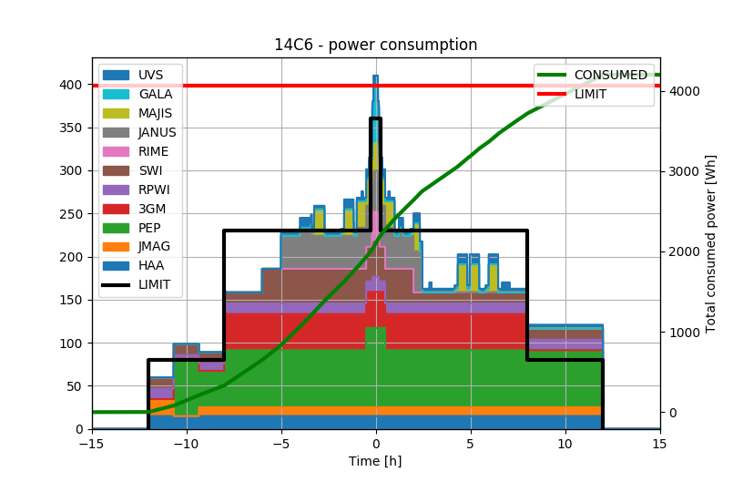
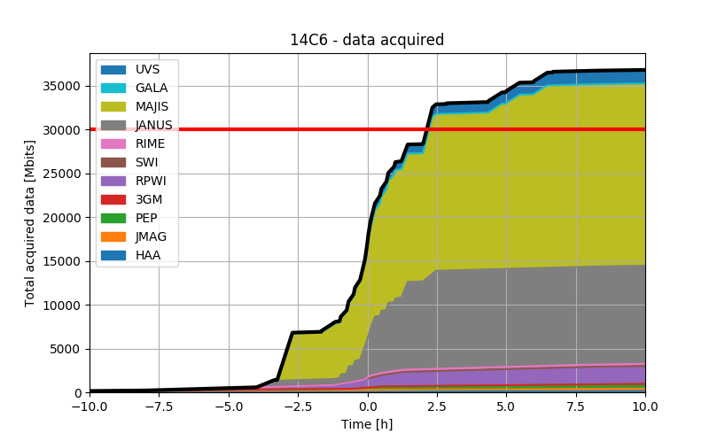
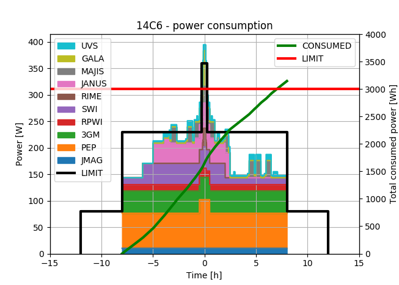

# Resource analysis

Using the `resource_analysis` package, we can perform analysis of consumed resources on a MAPPS scenario.

We export the datapack containing spacecraft resources from MAPPS, and analyze it:

## Power consumption
```python
from spice_tools.resource_analysis import PowerConsumptionGraph
# Import MAPPS datapack containing spacecraft resource data
# First we analyze power consumption
pcg = PowerConsumptionGraph("14C6", '2031-04-25T22:40:47',
                            r"tests\14c6_test_power_and_data.csv",
                            power_limit_Wh=4065.0,
                            add_HAA=True # we manually add HAA because it is not tracked by MAPPS
                            )

# Show total power consumed and individual instruments
pcg.print_total_power_consumed()
pcg.print_individual_instrument_consumption()
```
```
Total power consumed: 4199.1 (103.3% of limit).

Consumption by instrument:
 - HAA  :   360.0 Wh -  8.6%
 - JMAG :   243.6 Wh -  5.8%
 - PEP  :  1495.1 Wh - 35.6%
 - 3GM  :   670.0 Wh - 16.0%
 - RPWI :   280.1 Wh -  6.7%
 - SWI  :   529.4 Wh - 12.6%
 - RIME :    10.5 Wh -  0.2%
 - JANUS:   316.0 Wh -  7.5%
 - MAJIS:   157.5 Wh -  3.8%
 - GALA :    31.5 Wh -  0.8%
 - UVS  :   105.3 Wh -  2.5%
```

Now we plot the consumption graph.
```python
pcg.plot()
```



## Data acquisition
```python
from spice_tools.resource_analysis import DataConsumptionGraph
# We can use the same datapack, as long as it contains
# required fields with data consumption values.
dcg = DataConsumptionGraph("14C6", '2031-04-25T22:40:47',
                           r"tests\14c6_test_power_and_data.csv",
                           data_limit_Mbits=30000.0,
                           add_HAA=True)
dcg.print_total_data_acquired()
dcg.print_individual_instrument_data()
```
```
Total data acquired: 36896.2 Mbits (123.0% of limit).

Consumption by instrument:
 - HAA  :   172.8 Mbits -  0.5%
 - JMAG :   303.4 Mbits -  0.8%
 - PEP  :   561.3 Mbits -  1.5%
 - 3GM  :     5.8 Mbits -  0.0%
 - RPWI :  2054.5 Mbits -  5.6%
 - SWI  :    19.4 Mbits -  0.1%
 - RIME :   249.3 Mbits -  0.7%
 - JANUS:  11184.8 Mbits - 30.3%
 - MAJIS:  20734.1 Mbits - 56.2%
 - GALA :    66.0 Mbits -  0.2%
 - UVS  :  1544.9 Mbits -  4.2%
```
```python
dcg.plot()
```



## Constraining time intervals
We can also specify tighter time intervals to investigate only
a specific period in a scenario:

```python
# Constraining a time interval
pcg2 = PowerConsumptionGraph("14C6", '2031-04-25T22:40:47',
                             r"..\tests\14c6_test_power_and_data.csv",
                             power_limit_Wh=3000.0,
                             add_HAA=False,
                             time_interval_h=(-8, +8))

pcg2.plot()
```

